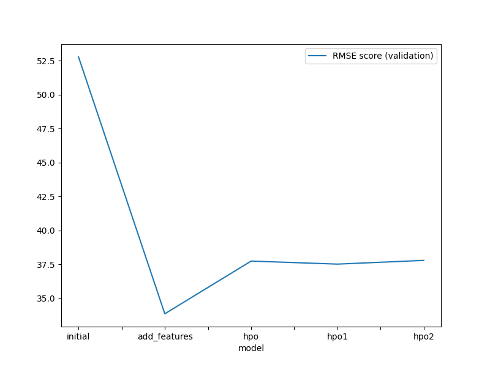
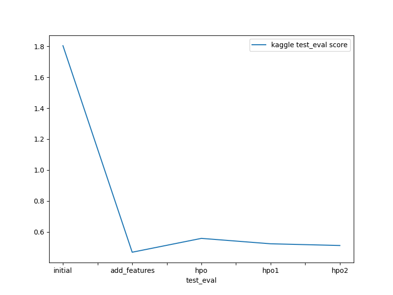

# Predict Bike Sharing Demand using AutoGluon

This project is part of the **AWS Machine Learning Fundamentals Nanodegree** (AWS x Udacity) and demonstrates how to apply the open-source AutoML library [AutoGluon](https://auto.gluon.ai/) to predict bike rental demand using data from Kaggle's [Bike Sharing Demand](https://www.kaggle.com/c/bike-sharing-demand) competition.

The goal is to use AutoGluon's Tabular Prediction API to build powerful models with minimal manual intervention — eliminating the need for custom data cleaning, preprocessing, feature engineering, hyperparameter tuning, and model selection.

---

## Overview

We trained and compared multiple AutoGluon-based models through the following stages:

1. **Initial Raw Model**  
2. **Feature Engineering Enhancements**
3. **Hyperparameter Optimization**  
    - HPO: Initial Setting  
    - HPO: Setting 1  
    - HPO: Setting 2 (Best HPO model)

Submissions were made to Kaggle after ensuring the predictions were post-processed correctly to meet the required format.

---

## Key Challenges and Fixes

### Submission Fixes

- Some predictions contained negative `count` values — which Kaggle rejects.
- To resolve this:
  - All negative predictions were replaced with `0`.
  - The predicted values were merged with the `datetime` column from the test set.
  - The final file was saved as `submission.csv` with two columns: `datetime`, `count`.

---

## Top Performing Model

- **Model Name:** `WeightedEnsemble_L3`
- **Validation RMSE:** 33.87
- **Key Detail:** Outperformed all hyperparameter-tuned models despite being trained only with added features and no tuning.

---

## Feature Engineering Summary

- Extracted `year`, `month`, `day`, and `hour` from the `datetime` column.
- Converted `season` and `weather` to categorical variables.
- Dropped `casual`, `registered` (leakage) and `atemp` (high collinearity with `temp`).
- Created a new `day_type` feature to indicate “weekday”, “weekend”, or “holiday”.

This significantly improved model accuracy by helping AutoGluon leverage temporal and categorical patterns.

---

## Hyperparameter Tuning

Three configurations were tested using different model families and presets. However, due to constraints in time and compute, the best score was still achieved with the EDA-enhanced model using default hyperparameters.

Key learnings:

- AutoGluon's `presets`, `time_limit`, and model types directly impacted success.
- Using lightweight configurations like `optimize_for_deployment` was more practical than `high_quality` in limited-resource environments.

---

## Model Comparison Table

| Model        | hpo_initial                                  | hpo1        | hpo2                                        | Kaggle Score |
|--------------|----------------------------------------|--------------|-----------------------------------------------|---------------|
| initial      | prescribed_values                      | prescribed_values | `presets: 'high quality' (auto_stack=True)` | 1.80448       |
| add_features | prescribed_values                      | prescribed_values | `presets: 'high quality' (auto_stack=True)` | 0.46797       |
| hpo (hpo2)   | Tree-Based Models (GBM, XT, XGB, RF)   | KNN          | `presets: 'optimize_for_deployment'`         | 0.51152       |

---

## Results

### Training Scores

### Kaggle Submission Scores

---

## Summary

This project showcases how powerful and accessible AutoML can be when paired with appropriate domain knowledge and data preprocessing. Key takeaways:

- **AutoGluon** enabled rapid model development with minimal code.
- **EDA and feature engineering** outperformed even tuned models.
- **Model tuning** improved results but required careful balancing of resources and search space.
- **Platform Compatibility**: Due to version mismatches, development was completed on Kaggle Notebooks.

AutoGluon proved to be a robust solution for structured data regression problems — especially when combined with strategic preprocessing and minimal tuning.
